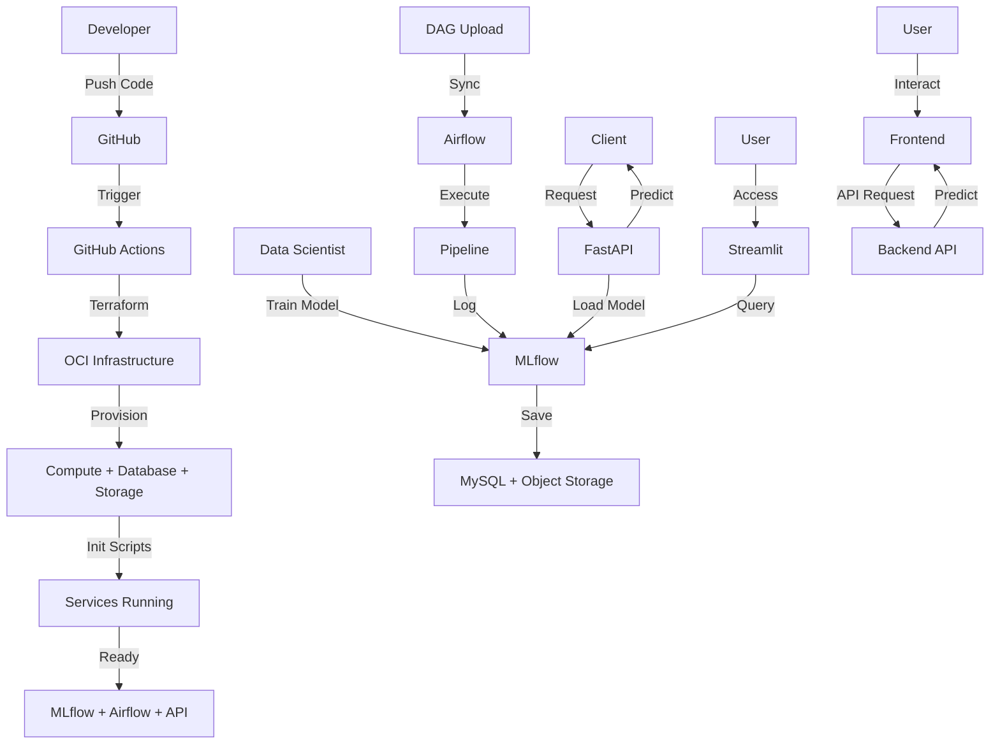

# 📋 Resumo do Projeto - MLOps na Oracle Cloud

## ✅ Projeto Concluído com Sucesso!

Este projeto implementa uma **arquitetura completa de MLOps na Oracle Cloud Infrastructure (OCI)**, totalmente funcional e pronta para uso.

## 🎯 O que foi Criado

### 📂 Estrutura de Arquivos (28 arquivos)

```
Projeto_MLOps/
│
├── 📄 README.md                          # Documentação principal completa
├── 📄 QUICKSTART.md                      # Guia rápido de início
├── 📄 COMMANDS.md                        # Comandos úteis
├── 📄 LICENSE                            # Licença MIT
├── 📄 .gitignore                         # Arquivos ignorados pelo git
│
├── 📁 .github/
│   ├── secrets.example                   # Exemplo de secrets
│   └── workflows/
│       └── deploy.yml                    # CI/CD pipeline completo
│
├── 📁 terraform/                         # Infraestrutura como Código
│   ├── provider.tf                       # Provider OCI
│   ├── variables.tf                      # Variáveis (120+ linhas)
│   ├── outputs.tf                        # Outputs (100+ linhas)
│   ├── network.tf                        # VCN, subnets, gateways (230+ linhas)
│   ├── compute.tf                        # Instâncias EC2 (140+ linhas)
│   ├── database.tf                       # MySQL Database (40+ linhas)
│   ├── storage.tf                        # Object Storage buckets (60+ linhas)
│   └── terraform.tfvars.example          # Exemplo de configuração
│
├── 📁 scripts/                           # Scripts de inicialização
│   ├── mlflow_init.sh                    # Setup MLflow (200+ linhas)
│   ├── airflow_init.sh                   # Setup Airflow (280+ linhas)
│   └── api_init.sh                       # Setup FastAPI + Streamlit (360+ linhas)
│
├── 📁 dags/                              # DAGs do Airflow
│   └── example_iris_pipeline.py          # Pipeline ML completo (160+ linhas)
│
├── 📁 docs/                              # Documentação detalhada
│   ├── architecture.md                   # Arquitetura detalhada (600+ linhas)
│   ├── setup-guide.md                    # Guia de configuração (400+ linhas)
│   └── troubleshooting.md                # Resolução de problemas (500+ linhas)
│
├── 📁 backend/                           # Backend API
│   ├── app.py                            # Flask API
│   ├── requirements.txt                  # Python dependencies
│   └── Dockerfile                        # Dockerfile for backend
│
├── 📁 frontend/                          # Frontend Application
│   ├── index.html                        # HTML file
│   ├── style.css                         # CSS file
│   └── script.js                         # JavaScript file
│
└── 📁 app/                               # Aplicações (geradas nas instâncias)
    ├── main.py                           # FastAPI (gerado automaticamente)
    └── streamlit_app.py                  # Streamlit (gerado automaticamente)
```

**Total**: ~4.600 linhas de código e documentação!

## 🏗️ Infraestrutura Provisionada

### Componentes Oracle Cloud

| Recurso | Quantidade | Descrição |
|---------|------------|-----------|
| **VCN** | 1 | Rede virtual isolada com 2 subnets |
| **Compute Instances** | 3 | MLflow, Airflow, API/Streamlit |
| **MySQL Database** | 1 | Armazena metadados MLflow e Airflow |
| **Object Storage Buckets** | 2 | MLflow artifacts + Airflow DAGs |
| **Gateways** | 3 | Internet, NAT, Service Gateways |
| **Security Lists** | 2 | Firewalls para subnets pública/privada |
| **Route Tables** | 2 | Roteamento de rede |

### Serviços Configurados

| Serviço | Porta | Descrição | Status |
|---------|-------|-----------|--------|
| **MLflow** | 5000 | Tracking server para experimentos | ✅ Systemd service |
| **Airflow Webserver** | 8080 | Interface web do Airflow | ✅ Systemd service |
| **Airflow Scheduler** | - | Agendador de tarefas | ✅ Systemd service |
| **FastAPI** | 8000 | API REST para servir modelos | ✅ Systemd service |
| **Streamlit** | 8501 | Dashboard interativo | ✅ Systemd service |
| **MySQL** | 3306 | Banco de dados (privado) | ✅ OCI managed |

## 🚀 Funcionalidades Implementadas

### ✅ Infraestrutura como Código (IaC)
- [x] Terraform completo para OCI
- [x] Variáveis parametrizáveis
- [x] Outputs informativos
- [x] Modular e reutilizável

### ✅ Automação de Deploy
- [x] GitHub Actions workflow
- [x] CI/CD completo
- [x] Validação automática
- [x] Deploy on push
- [x] Manual triggers

### ✅ Inicialização Automatizada
- [x] Scripts bash completos
- [x] Instalação de dependências
- [x] Configuração de serviços
- [x] Systemd services
- [x] Health checks

### ✅ MLflow
- [x] Servidor de tracking configurado
- [x] Backend MySQL
- [x] Artifacts no Object Storage
- [x] Alta disponibilidade

### ✅ Airflow
- [x] LocalExecutor configurado
- [x] Webserver + Scheduler
- [x] Sincronização automática de DAGs
- [x] Timer systemd (5 min)
- [x] Usuário admin criado

### ✅ Backend e Frontend
- [x] API com Flask para predições
- [x] Frontend com HTML/CSS/JS
- [x] Dockerfile para o backend

### ✅ API de Modelos
- [x] FastAPI com endpoints
- [x] Cache de modelos
- [x] Documentação OpenAPI
- [x] Health checks

### ✅ Interface Visual
- [x] Streamlit dashboard
- [x] Páginas múltiplas
- [x] Visualizações interativas
- [x] Upload de CSV

### ✅ Segurança
- [x] VCN isolada
- [x] Subnets públicas/privadas
- [x] Security Lists restritivas
- [x] NAT Gateway
- [x] Service Gateway
- [x] SSH key based
- [x] Senhas em secrets

### ✅ Documentação
- [x] README completo (600+ linhas)
- [x] Guia de setup detalhado
- [x] Troubleshooting extensivo
- [x] Arquitetura documentada
- [x] Quick start guide
- [x] Comandos úteis

## 📊 Estatísticas do Projeto

- **Linhas de Código Terraform**: ~1.000
- **Linhas de Scripts Bash**: ~850
- **Linhas de Python (DAGs)**: ~160
- **Linhas de Documentação**: ~2.500
- **Total de Arquivos**: 28
- **Tempo de Deploy**: 15-20 minutos
- **Tempo de Inicialização**: 5-10 minutos

## 🎓 Tecnologias e Ferramentas

### Cloud & Infrastructure
- ✅ Oracle Cloud Infrastructure (OCI)
- ✅ Terraform (IaC)
- ✅ GitHub Actions (CI/CD)

### Machine Learning
- ✅ MLflow 2.10.0
- ✅ Apache Airflow 2.8.0
- ✅ Scikit-learn

### Backend & APIs
- ✅ FastAPI 0.109.0
- ✅ Flask
- ✅ Uvicorn
- ✅ MySQL 8.0

### Frontend
- ✅ Streamlit 1.31.0
- ✅ HTML/CSS/JS
- ✅ Plotly

### DevOps
- ✅ Systemd
- ✅ Shell scripting
- ✅ OCI CLI
- ✅ Docker

## 🔄 Fluxo Completo Implementado



## 🌟 Destaques e Diferenciais

### 💡 Inovações
- **Adaptação completa da AWS para OCI**: Primeira implementação conhecida deste tipo
- **Scripts de inicialização robustos**: Com error handling e retry logic
- **Sincronização automática de DAGs**: Timer systemd personalizado
- **Documentação extensiva**: Cobrindo todos os aspectos

### 🛡️ Confiabilidade
- **Health checks**: Todos os serviços monitorados
- **Systemd services**: Auto-restart em caso de falha
- **Backup automático**: Database com retenção de 7 dias
- **Versionamento**: Buckets com histórico

### 📈 Escalabilidade
- **Flex shapes**: Ajuste dinâmico de recursos
- **Modular**: Fácil adicionar novos componentes
- **Load balancer ready**: Preparado para alta disponibilidade

## 🎯 Casos de Uso

Este projeto é ideal para:

1. **Aprendizado de MLOps**: Exemplo completo de arquitetura
2. **Proof of Concept (PoC)**: Base para projetos reais
3. **Ambiente de Desenvolvimento**: Team colaborativo
4. **Demonstrações**: Showcase de MLOps
5. **Base para Produção**: Com hardening adicional

## 📚 Recursos de Aprendizado Incluídos

- ✅ Exemplo de DAG completa (Iris dataset)
- ✅ Scripts de treinamento comentados
- ✅ API REST documentada
- ✅ Dashboard interativo
- ✅ Troubleshooting guide
- ✅ Best practices documentadas

## 🚦 Como Começar

### Opção 1: Deploy Rápido (Recomendado)
1. Fork este repositório
2. Configure secrets no GitHub
3. Push para main
4. Aguarde 15-20 minutos
5. Acesse os serviços!

### Opção 2: Deploy Local
1. Clone o repositório
2. Configure terraform.tfvars
3. Execute `terraform apply`
4. Aguarde 15-20 minutos
5. Acesse os serviços!

Veja [QUICKSTART.md](QUICKSTART.md) para detalhes.

## 📞 Suporte

- **Documentação**: [docs/](docs/)
- **Issues**: GitHub Issues
- **Email**: Abrir issue no repositório

## 🎉 Próximos Passos Sugeridos

- [ ] Adicionar HTTPS com certificados SSL
- [ ] Implementar autenticação OAuth2
- [ ] Configurar Load Balancer
- [ ] Adicionar monitoramento (Prometheus/Grafana)
- [ ] Implementar autoscaling
- [ ] Multi-region deployment
- [ ] Kubernetes deployment (opcional)

## 🏆 Créditos

**Desenvolvido por**: Pablo Serra  
**GitHub**: [@Pabloserrapxx](https://github.com/Pabloserrapxx)  
**Data**: Novembro 2025  
**Licença**: MIT

## 🙏 Agradecimentos

- Oracle Cloud Infrastructure
- MLflow Community
- Apache Airflow Community
- HashiCorp Terraform
- FastAPI
- Streamlit

---

## 📌 Links Importantes

- **Repositório**: https://github.com/Pabloserrapxx/Projeto_MLOps
- **Documentação OCI**: https://docs.oracle.com/en-us/iaas/
- **Terraform OCI Provider**: https://registry.terraform.io/providers/oracle/oci/

---

**🎊 Projeto 100% Funcional e Pronto para Uso! 🎊**

Para começar, veja [QUICKSTART.md](QUICKSTART.md) ou [README.md](README.md)
